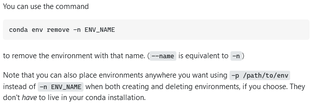

# what I was trying to do

install anaconda and the related things that come with it that i can see we need for this course

+ tutorial: https://graddh.netlify.app/docs/tutorials/anaconda/
+ repo: `[anaconda](https://github.com/bad-d0nkey/digital-basics/anaconda)`

## how it might connect to other research I'm doing

i know that anaconda is the suite that the folks who have shown me a few things related to their work in text analysis and network analysis have used. i don't know what exactly they do, but i know this is where they do it. this is definitely something i need to know how to get around in.

## what I did

+ step 1: uninstalled previous anaconda
	+ there was something wrong the version i had installed for a seminar last year - uninstalled this and deleted the rando little folders it seemed to deposit here and there

+ step 2: installed anaconda anew
	+ no problems here 

+ step 3: installed the add-ons (or whatever they are called)
	+ installed jupyter, orange, and rstudio
	+ rstudio installed twice, somehow, and resulted in 2 r-related environments

+ step 4: uninstalled second r environment
  + this required stackoverflowing -> i located this [thread](https://stackoverflow.com/questions/49127834/removing-conda-environment) and picked out the pieces _i hoped_ i needed, specifically...

  + i identified that the extra rstudio environment had a hyphen after the name, so i entered
  
  `conda env remove -p C:\Users\lefev\anaconda3\envs\rstudio-`

  and this worked out just fancy and fine. the second environment was removed from the anaconda navigator. the folder still remained in the C:\ drive, so i just deleted it. not usually a good rationale, but seeing as how i hadn't used it for anything and the environment that relied upon it didn't exist anymore, i was cool with being wild and crazy like this. 

## challenges 

this was a basic gettin'-to-know-ya deal, so there were no challenges here, other than the minor hiccups described above.  

## thoughts on where to go next

i want to understand a bit more about the anaconda navigator. why would i use this over the terminal? where do things go when you save things? i have found a few different places related folder pop up. assuming i don't discover anything wild and crazy and anaconda proper, i will probably start using the tools it connects, like jupyter and _maybe_ rstudio. but rstudio looks scary. so that might be a future laura thing. 
