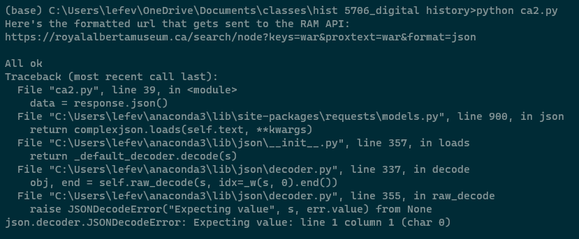

# what I was trying to do

first introduction to accessing apis for a website.

+ tutorial: https://graddh.netlify.app/docs/tutorials/apis/
+ repo: `[apis](https://github.com/bad-d0nkey/digital-basics/apis)`

## how it might connect to other research I'm doing

i know that a lot of the data i use in projects comes from sites that have apis. i have always had to use some jury-rigged way of scraping the data with tools that don't require a lot of technical skills. this has had... mixed results. i'm honestly at the end of my rope with this - i _know_ it can be done better and faster. but i didn't know how to start _allthethings_. this is the place to start. how exactly it will feature, i'm not sure, but i'm hoping i will be able to apply that when i figure out when it's used in terms of the kinds of info i need.

## what I did

+ step 1: checked out the [website](https://chroniclingamerica.loc.gov/) and ran the search  
	+ i could see what the instructions were talking about. not lost yet!

+ step 2: created the [script](ca.py)
	+ read through the tutorial first, then plunked all of the script into the text editor so i could read along in context while reviewing the explanation
	+ i could mostly follow this through - which is cool

+ step 3: checked for modules
	+ pip and pygments were installed, but json returned no result
	+ i had had a problem with json previously, so i thought perhaps this was a prevailing thing
	+ [stackoverflowing advised](https://stackoverflow.com/questions/61112485/why-is-pip-install-json-showing-version-error) that with the sort of dealio we have set up for ourselves, we don't have to specifically install json anymore
	  + i am satisfied with this answer because i just uninstalled and reinstalled the latest things
  + did a test in my terminal "settings" function and the json button that was greyed out yesterday was now visible
 
 + step 4: ran the script
  + this went fine. 
  + i then checked where the [output](data.JSON) went to live and found it quite healthy and happy in a very logical place

+ step 5: tried converting the file
  + easy-breasy. [see ?](data.csv)

+ step 6: tried doing one on my own
  + nope. but i suspect this is because of the nature of the site i picked. it was likely not a good one for this.
  + made a new [script file](ca2.py)
  + ran the deal and got this...

 

  + i worked through what the error returned and dug a little, but left this. rationale below...

+ step 7: checked out the other examples on the coursebook page
  + did some clicking, but found i didn't really know how to orientmyself. left this. rationale below... 

## challenges 

i couldn't find any information about where i could see json in action in a terminal window (or whatever the right terminology around this is). i have seen people provide screenshots of a terminal window with json code and have seen instructions to use it to, for example, [change the colour of your window](https://github.com/bad-d0nkey/digital-basics/blob/main/command-line-for-pc/%20log-file-for-tutorial-on-command-line-basics-for-pc.md#what-i-did). i don't need to know json right now and getting comfortable with keeping this company. stopping here is all right. 

i also couldn't exactly work through the error i got when i tried this on my own. to be blunt, i think too little knowledge went into designing the experiment. when i went to others to see how it all worked, there was a bit more going on in the repositories than i understood. i get more about github now than i did before. i get more about working in prompt now than i did before. looking at these was easier than it would have been a week ago. with a bit more rooting around, i will be able to return to this and fumble my way through. stopping here, where i have had some success, is all right. 

## thoughts on where to go next

a bit of general digging around to understand more about apis and how to sort this stuff out followed by some fumbling about. i don't know enough to list specifics, but i suspect the specific things i will look at will shake loose from the aforementioned digging around. 

