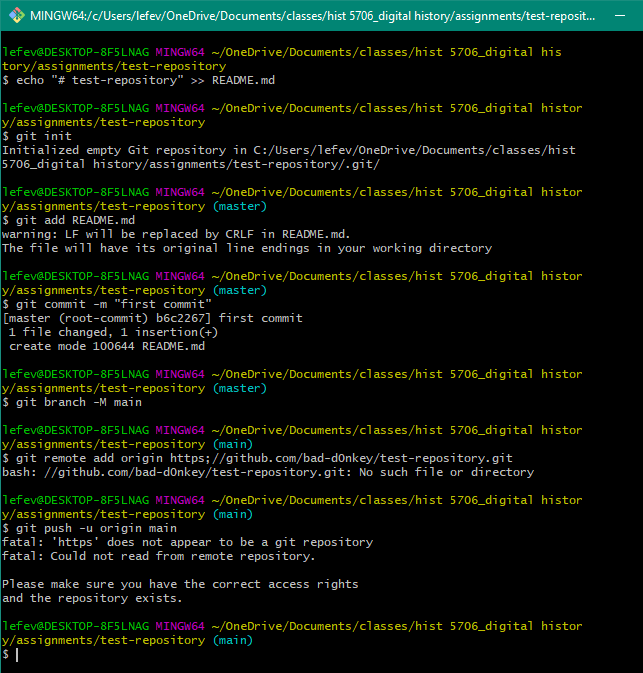
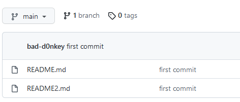

# what I was trying to do

I reviewed the basics of GibHub use in the coursebook. 
+ tutorial: https://graddh.netlify.app/docs/tutorials/github-basic/
+ repo (**NB**: I created this repo following the tutorial - there is no documentation for the activity itself): `[how-did-they-do-that](https://github.com/bad-d0nkey/how-did-they-do-that)`
	
I also began the "Build Your Presence" tutorial. 
+ tutorial: https://shawngraham.github.io/dhmuse/building-your-online-presence/
+ repo (**NB**: my "success" was working through the first step - not in editing the page): `[academic-kickstart](https://github.com/bad-d0nkey/academic-kickstart)`

My attention was on doing the basics _right_. I can jury-rig my way through things, but it's not in a fun "try and fail" way - it's actually really counterproductive. I wanted to fill in the gaps so attempts/fails actually got somewhere beyond the first step. You know that "if nothing happens in the first half hour..." expression you have? It was an endless series of frustrating half-hours that never got beyond that. No more! 
	
## how it might connect to other research I'm doing

I'm not sure about the _how_. I know it will. A lot of the projects I am interested in use GitHub. Because I didn't know how to use it, I didn't understand how to explore what was there, really. Now that I sort of understand, I will be able to see what potentials there are, what else to learn, and why those things over others. [Markdown](https://github.com/bad-d0nkey/digital-basics/blob/main/markdown/log-file-for-tutorial-on-markdown.md), of course, links to this.

## what I did

+ step 1: identified the really _really_ basics  
	+ I checked out the tutorials provided and decided just to follow along with what was in the coursebook. This was a good idea. 

+ step 2: created & initialized a repository on github
	+ Well... a repository was created on github. I had done that before, but this was methodical. I wanted to try other ways, so I deleted this repository and did it again in the next step. 

+ step 3: created a repository and added readme locally
	+ Okay, this just did not work. I could get the file to write, but the final step (with the -u flag) delivered an error message every time. It just would not push the readme to github online. 
	
	
	
+ step 4: started to look for a fix
	+ And then remembered all the other times I had failed because I tried to "understand all the things" and stopped. 
	+ If this is something I need to do in the future, I will look into it. Now that I know it exists, it will twig my memory if someone says, "Oh, you should just...." and I can look into it then. I have failed every other time because I sit down and try to be methodical but without knowing why, having practice with results to look at, and then seeing where things fit, I end up having floaty knowledge with no home. So I did the clever thing and _stopped_.

+ step 5: created a readme.md locally through the app and pushed to github
	+ This worked immediately. I had downloaded github for desktop, knowing that I intend to use this in future. I hadn't been able to figure it out up to now because I didn't know *why* I would want to do this. 
	+ Knowing that _why_ I want to do this is to accomplish a narrow task for this exercise, I had a purpose and didn't need to identify what of the 1,000 things online I needed to focus on. Focusing _only_ on the steps that had been covered in the tutorial and not the thousand other overwhelming things, I was able to create the file locally
	
	
	
	_and_ see it show up online shortly thereafter (readme2.md)
	
	

+ step 6: created skeleton of "academic profile"
	+ I wanted to take this one step farther. One step is growth and is enough even if it doesn't really make any sense to do it. I have now done the things _and_ done something with it. In future, I will continue from this step. At least it is started and I now have something to hang the other steps on. 
	
## challenges 

Step 4 was the one thing that didn't get resolved. I suspect it relates to permissions. For a computational linguistics class I'm taking at the U of A, we have my computer modded in all sorts of fancy ways that I don't understand, so I don't exactly know what questions to ask of what first or why. 

+ For example, I know I have bash running on my PC. 
+ I also know I can't run bash directly - it won't run at all (and a computer wiz confirmed this with me). I have to use Terminal to then launch Ubuntu to run Bash. 
+ I also-also know that I have to run Terminal as administrator, but run Linux as a prole. This has affected how other things run (_e.g._, my option to run git at the folder level in Step 4 is actually, despite being on a PC, "Git Bash Here"). 
+ Lastly, I also-also-also know that these different weirdo snippets have each, at varying times, offered some sort of administrative interference with other programs. 

But. None of that matters. Right now, starting a thing and finishing a thing matters. 
But this is a challenge I will definitely look into when I have more ground under me. I mean, I'm also afraid my computer is going to explode from some multiple personality disorder-related recursive loop, so knowing what the frak they have done to my poor beast and why would be kind of nice.

Oh. Also, content control. I'm a bit OCD. Now I have extra folders floating around for no good reason and can't delete them because I didn't think this through. These need to stay so you can see them. Laura, maybe you should have made repositories that you could actually _use_. I guess it's not content control that's the challenge  - thinking about the endgame despite not being presently confident in what I'm doing would be. ;)

## thoughts on where to go next

I am going to practice these steps a bunch more times (but with a purpose - no more useless folders). 

I am going to practice github a bit more on its own. 

I am going to, when I'm a bit steadier, look at finishing the static website exercises.
