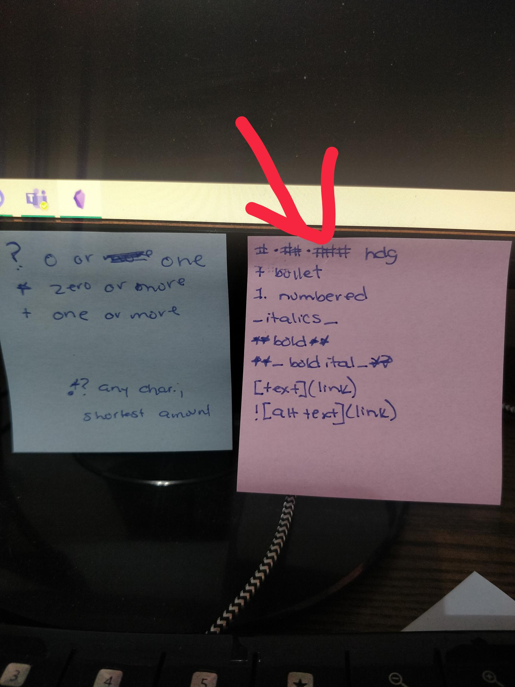

# what I was trying to do

I tinkered around with markdown. To try and learn... markdown.

+ tutorial: https://graddh.netlify.app/docs/tutorials/markdown/
+ repo: `[hist-5706/digital-basics/markdown](https://github.com/bad-d0nkey/hist-5706/tree/main/digital-basics/markdown)`

## how it might connect to other research I'm doing

The only thing I can think of right now is that this is what we're using for our Obsidian notes. I'm sure it will come into play more now that it's something I have committed to doing. 

## what I did
+ I followed the outline in the coursebook.
	+ This went fine. 

+ I started to follow along with the [Programming Historian](https://programminghistorian.org/en/lessons/getting-started-with-markdown) tutorial.
	+ This did not go fine. 
	+ It is not useful for me to introduce multiple new concepts at once (_i.e._, StackEdit in addition to markdown in addition to Obsidian)... 
 
+ So, instead, I tinkered with other 101-type resources and made some grown-up notes for posterity and some actually-using-them notes for my computer monitor.
	+ Which also went fine. 
	
	See? Fancy. 

	

## challenges 

Overall, I'm a bit confused by the variations that don't seem to have a good reason for them. 

I know there are some flavours that are platform- or product-related, but there seem to be some distinctions (_i.e._, * vs. + for a bullet) that don't have seem to have clear rationale. Maybe it's a legacy thing? I shall learn with more digging.  

The approach I was using before may explain some of the difficulties I've had with Obsidian, come to think of it...

## thoughts on where to go next

Honestly, I'm good here. I'm going to keep practising on my own and looking into some of the problems I've had (like doing tables - is this an Obsidian thing or do I generally have it wrong?) when they come up again. 

This is on my list of daily doings and I don't feel the need to chat about it presently. Plus, when a specific issue comes up, I can go to the intertubes first. I'm not exactly putting markdown through its paces with my level of use, so I'm not entirely sure there will be many challenges to record before this course wraps up. This will be an "as it comes" sort of deal.
