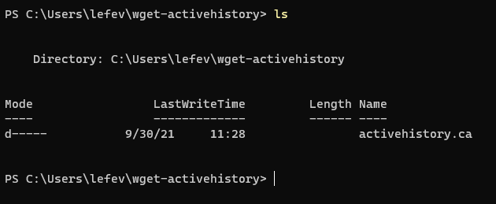

# what I was trying to do

i attempted the wget tutorial. to learn how to run wget. 
okay, that's a lie. it's because i secretly want to terrorize the province of quebec and i've heard this is a good place to start. 

i also need to understand what it is, why i would use it, and where it fits/lives in the mishmash set-up i've got going on. 

+ link to the tutorial: https://graddh.netlify.app/docs/tutorials/wget/
+ link to repo: like this: `[wget](https://github.com/bad-d0nkey/digital-basics/wget)`

## how it might connect to other research I'm doing

i am actually not sure yet. the term has come up a few times, so i know it's something i need to know. i just don't know when those circumstances are. 

## what I did

+ step 1: sort out the command prompt/powershell/terminal/ubuntu thing
	+ okay, that was not so confusing after all
	
+ step 2: determine if wget was installed
	+ typed wget in powershell (via terminal) -> it was not installed
	+ typed wget in ubuntu (via terminal) -> it was installed 

+ step 3: installed wget
	+ had to confirm if i was to use the 32-bit or 64-bit version (Shawn to the rescue)
	+ installed the 64-bit version; followed the coursebook instructions
	+ tested installation and was good to go

+ step 4: created directory, navigated around to test previous learnings
	+ was able to move around and return to directory

+ step 5: ran command on activehistory.ca/papers
	+ got an error message but not one heralded in the coursebook
	
	

	+ checked stackoverflow but i don't have the terminology quite right - the results i was turning up weren't related
	+ tried the .exe thing in the coursebook anyway -> it worked

+ step 6: tried to save output
	+ again, this is a terminology thing - i know "output" is probably problematic terminology for this
	+ i found results for very specific scenarios that seemed to be talking about the same thing i am, but they were ultimately not helpful
	+ i manually copied the results and pasted them into a .txt file. [right here, in fact](https://github.com/bad-d0nkey/digital-basics/blob/4fe395b0f304124bd13f5dfcffb34ecc43be00bf/wget/wget_output.txt)
 	
+ step 7: tried to noodle out where these results went and why the directory thing mattered
	+ the results don't show up in the directory

	

	+ and the terminology thing is getting in my way again. i can't find content that explains how a directory created in these circumstances function - are they "for real"? are they sort of cache-like thing? not clear as yet.

## challenges 

i don't know what i don't know. i need to ask questions re: the above so i can dig more.

## thoughts on where to go next

i'll be asking questions in discord. i really don't know how this fits into anything. when i can dig more, i will be able to ask better questions and solve the remainign riddles i have. and open a whole world of other ones, i'm sure. lol.
