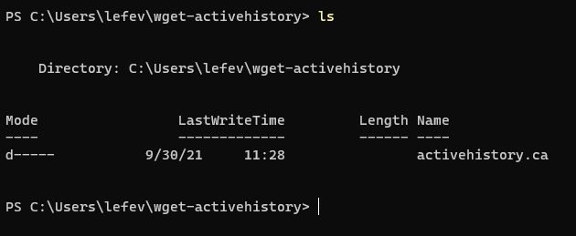

# what I was trying to do

i attempted the wget tutorial. to learn how to run wget.
okay, that's a lie. it's because i secretly want to terrorize the province of quebec and i've heard this is a good place to start. 

i also need to understand what it is, why i would use it, and where it fits/lives in the mishmash set-up i've got going on. 

+ tutorial: https://graddh.netlify.app/docs/tutorials/wget/
+ repo: like this: `[wget](https://github.com/bad-d0nkey/digital-basics/wget)`

## how it might connect to other research I'm doing

i am actually not sure yet. the term has come up a few times, so i know it's something i need to know. i just don't know when those circumstances are. 

## what I did

+ step 1: sort out the command prompt/powershell/terminal/ubuntu thing so i know where to work
	+ okay, that was not so confusing after all
	
+ step 2: determine if wget was installed
	+ typed wget in powershell (via terminal) -> it was not installed
	+ typed wget in ubuntu (via terminal) -> it was installed 

+ step 3: installed wget
	+ had to confirm if i was to use the 32-bit or 64-bit version (Shawn to the rescue)
	+ installed the 64-bit version; followed the coursebook instructions
	+ tested installation and was good to go

+ step 4: created directory, navigated around to test previous learnings
	+ was able to move around and return to directory

+ step 5: ran command on activehistory.ca/papers
	+ got an error message but not one heralded in the coursebook
	
	

	+ checked stackoverflow but i don't have the terminology quite right - the results i was turning up weren't related
	+ tried the .exe thing in the coursebook anyway -> it worked

+ step 6: tried to save output
	+ again, this is a terminology thing - i know "output" is probably problematic terminology for this
	+ i found results for very specific scenarios that seemed to be talking about the same thing i am, but they were ultimately not helpful
	+ i manually copied the results and pasted them into a .txt file. [right here, in fact](https://github.com/bad-d0nkey/digital-basics/blob/4fe395b0f304124bd13f5dfcffb34ecc43be00bf/wget/wget_output.txt)
 	
+ step 7: tried to noodle out where these results went and why the directory thing mattered
	+ the results don't show up in the directory

	

	+ and the terminology thing is getting in my way again. i can't find content that explains how a directory created in these circumstances function - are they "for real"? are they sort of cache-like thing? not clear as yet.

## challenges 

i don't know what i don't know. i need to ask questions re: the above so i can dig more.

## thoughts on where to go next

i'll be asking questions in discord. i really don't know how this fits into anything. when i can dig more, i will be able to ask better questions and solve the remaining riddles i have. and open a whole world of other ones, i'm sure. lol.

## update

#### re: step 1/2

i've sorted out with the help of discord and good ole google what each of the mish-mash things is for. i know this isn't important for this class, but the way things were installed on my computer means that i have to access what i do need for this class _through_ the weird add-ons my prof installed. the commands overlap, too, so i think i'm learning something then it turns out the command doesn't work somewhere else. the findings have been these:

+ leave the ubuntu thing alone
	+ deal with that only as required for my LING class 
	+ i had been being prompted to use this _instead_ of command prompt because it was "better and was exactly the same thing" - but that wasn't the case and was causing me problems in HIST

+ i can access command prompt _through_ the WSL terminal thing
	+ i just need to launch that one i need when i need it (i have choices and now i know when to make them)

#### re: step 6

the output thing is still unclear. but i think the question i need to be asking is why i wanted to save it. 
+ i think where this came from was in my LING class, where it _looks_ like we're doing very similar things - and even using some of the same commands - but very much are not -> in LING, the results are important and aren't saved anywhere. when you move on, they're gone. 
+ as we needed to upload stuff to a repository (and as I couldn't figure out the thing below in step 7), this felt like a problem. i have discovered it is not.   

#### re: step 7

the `ls` command didn't work in the terminal, but when i navigated later to the C:\ drive, the files were there. i'm not sure why that is (and, again, terminology is getting in my way re: googling), but at least i know the thing worked - and that's the important part
